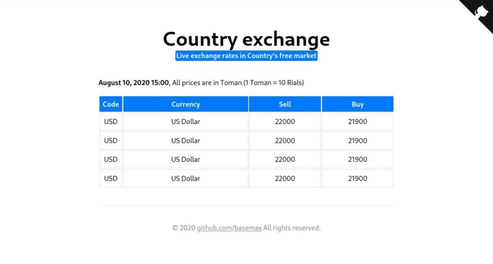
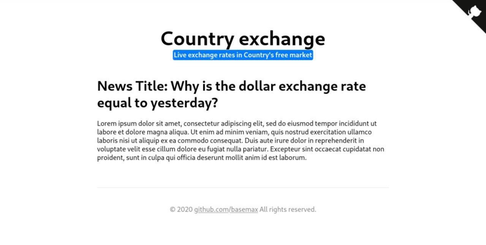

# live-exchange-rate-theme

A website template for live exchange rates in the free market.

## Pages

- Main page (https://basemax.github.io/live-exchange-theme/)
- Single/Post page (https://basemax.github.io/live-exchange-theme/single.html)
- History page (https://basemax.github.io/live-exchange-theme/history.html)

### Screenshots

---------

# Max Base

My nickname is Max, Programming language developer, Full-stack programmer. I love computer scientists, researchers, and compilers. ([Max Base](https://maxbase.org/))

## Asrez Team

A team includes some programmer, developer, designer, researcher(s) especially Max Base.

[Asrez Team](https://www.asrez.com/)

